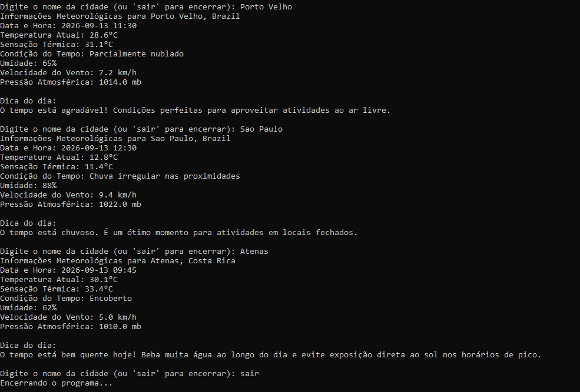

# Sistema de Informações Climáticas em Tempo Real

Aplicação de terminal que consulta uma API de clima real ([WeatherAPI](https://www.weatherapi.com/)) e exibe informações meteorológicas atualizadas de qualquer cidade digitada pelo usuário, além de uma dica personalizada com base nas condições do tempo.

## Funcionalidades

- Consulta contínua: permite buscar várias cidades até o usuário digitar "sair"
- Requisição HTTP à API do WeatherAPI usando `java.net.http.HttpClient`
- Leitura e interpretação da resposta em JSON (biblioteca `org.json`)
- Tratamento de erro para cidade não encontrada
- Dica automática baseada na condição climática (chuva, calor extremo ou tempo agradável)
- Chave da API mantida fora do código-fonte, lida de um arquivo separado (`api-key.txt`)

## Exemplo de uso



## Como rodar

Pré-requisitos: Java JDK e a biblioteca `org.json` (JSON-java) no classpath.

1. Crie uma conta gratuita em [weatherapi.com](https://www.weatherapi.com/) e gere sua chave de API.
2. Crie um arquivo `api-key.txt` na mesma pasta do projeto, contendo apenas sua chave.
3. Compile e execute:

```bash
javac -cp .:json-XXXXXXXX.jar ProjetoSistemaDeInformacoesClimaticasEmTempoReal.java
java -cp .:json-XXXXXXXX.jar ProjetoSistemaDeInformacoesClimaticasEmTempoReal
```

## Tecnologias

- Java
- `java.net.http` (HttpClient, HttpRequest, HttpResponse)
- `org.json` (parsing de JSON)
- Consumo de API REST externa
