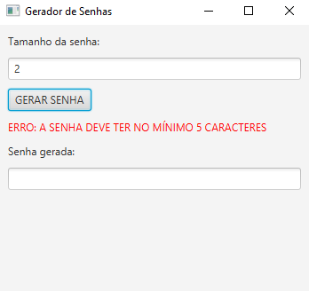
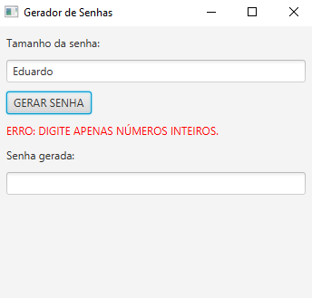
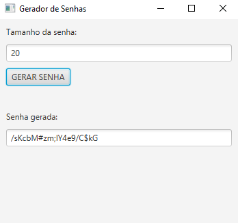

# Gerador de Senhas

Aplicação desktop com interface gráfica (JavaFX) que gera senhas aleatórias e seguras, com base em um tamanho definido pelo usuário.

## Funcionalidades

- Geração de senha aleatória com tamanho customizável
- Validação de entrada: exige número inteiro
- Validação de regra de negócio: tamanho mínimo de 5 caracteres
- Mensagens de erro claras para cada tipo de problema
- Campo de senha gerada bloqueado para edição (`setEditable(false)`)

## Tecnologias

- Java
- JavaFX (versão gráfica)
- `java.security.SecureRandom` (geração aleatória segura)

## Exemplos de uso

**Erro: tamanho abaixo do mínimo permitido**



**Erro: valor inválido (não numérico)**



**Senha gerada com sucesso**



## Estrutura

O projeto tem duas versões, e a versão com interface reaproveita a lógica da versão de terminal:

- `ProjetoGeradorDeSenhas.java` — versão original, roda no terminal e contém a lógica de geração da senha (usada também pela versão GUI)
- `ProjetoGeradorDeSenhasGUI.java` — versão com interface gráfica, validações e mensagens de erro

### Rodando a versão de terminal

```bash
javac ProjetoGeradorDeSenhas.java
java ProjetoGeradorDeSenhas
```

### Rodando a versão com interface (GUI)

```bash
javac --module-path /caminho/para/javafx-sdk/lib --add-modules javafx.controls ProjetoGeradorDeSenhasGUI.java ProjetoGeradorDeSenhas.java
java --module-path /caminho/para/javafx-sdk/lib --add-modules javafx.controls ProjetoGeradorDeSenhasGUI
```
