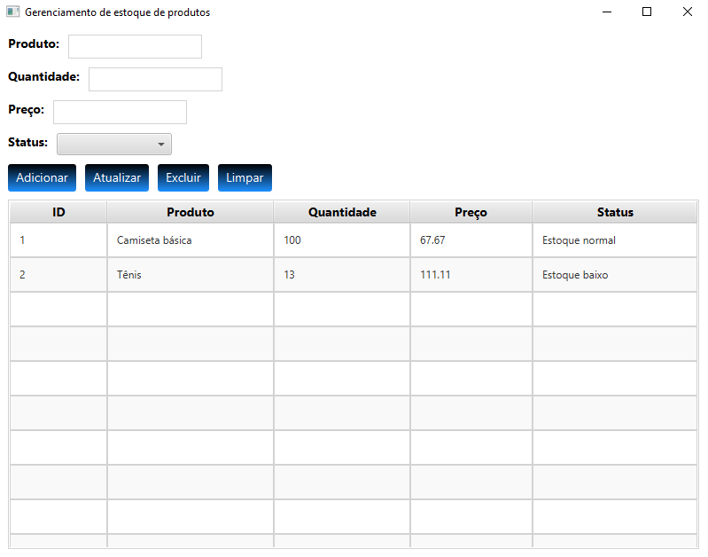

# Gerenciamento de Estoque de Produtos

Sistema desktop com interface gráfica (JavaFX) para gerenciar o estoque de produtos, com persistência real em banco de dados SQLite. Permite cadastrar, listar, atualizar e excluir produtos, além de acompanhar o status do estoque.



## Funcionalidades

- CRUD completo de produtos (Criar, Ler, Atualizar, Excluir)
- Persistência em banco de dados SQLite via JDBC
- Consultas seguras com `PreparedStatement` (proteção contra SQL injection)
- Visualização dos produtos em tabela (`TableView`), com seleção de linha preenchendo o formulário automaticamente
- Classificação de status do produto ("Estoque normal" / "Estoque baixo")
- Estilização visual através de arquivo CSS externo
- Fechamento seguro da conexão com o banco ao encerrar a aplicação

## Arquitetura

O projeto segue uma separação de responsabilidades no estilo DAO (Data Access Object):

- `Produto.java` — classe de modelo (representa um produto)
- `ProdutoDAO.java` — camada de acesso a dados: todas as operações SQL ficam isoladas aqui
- `ConexaoDB.java` — responsável por abrir a conexão com o banco de dados
- `CriadorTabela.java` — script utilitário para criar a tabela `produtos` no banco (rodar uma única vez, antes de usar o sistema)
- `ProdutoGUI.java` — interface gráfica, ponto de entrada da aplicação
- `styles-produtos.css` — estilização visual da interface

## Como rodar

Pré-requisitos: Java JDK, JavaFX SDK e o driver JDBC do SQLite (`sqlite-jdbc`) no classpath.

1. Rode o `CriadorTabela.java` uma única vez para criar a tabela no banco:
```bash
javac -cp .:sqlite-jdbc-X.X.X.jar CriadorTabela.java ConexaoDB.java
java -cp .:sqlite-jdbc-X.X.X.jar CriadorTabela
```

2. Compile e execute a aplicação:
```bash
javac --module-path /caminho/para/javafx-sdk/lib --add-modules javafx.controls -cp .:sqlite-jdbc-X.X.X.jar *.java
java --module-path /caminho/para/javafx-sdk/lib --add-modules javafx.controls -cp .:sqlite-jdbc-X.X.X.jar ProdutoGUI
```

> O arquivo do banco de dados (`meu_banco_de_dados.db`) é criado automaticamente na primeira conexão e não deve ser versionado no Git — cada pessoa que rodar o projeto gera o próprio banco localmente.

## Tecnologias

- Java
- JavaFX (`TableView`, `ComboBox`, CSS)
- JDBC + SQLite
- Padrão DAO (separação entre lógica de dados e interface)
