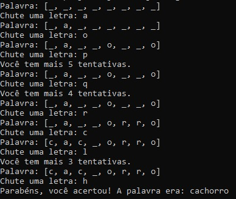
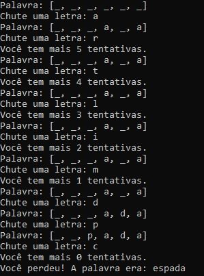

# Jogo da Forca

Jogo da forca clássico rodando no terminal. O programa sorteia uma palavra secreta e o jogador tenta descobri-la letra por letra, com um número limitado de tentativas.

## Funcionalidades

- Sorteio aleatório da palavra secreta entre uma lista de opções
- Exibição do progresso da palavra com underlines (`_`) para letras não descobertas
- Contagem de tentativas restantes
- Detecção automática de vitória (todas as letras descobertas) ou derrota (tentativas esgotadas)

## Exemplos de uso

**Partida vencida**



**Partida perdida**



## Como rodar

```bash
javac ProjetoJogoDaForca.java
java ProjetoJogoDaForca
```

## Tecnologias

- Java
- `ArrayList`
- `Random`
- `Scanner`
