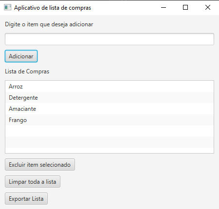
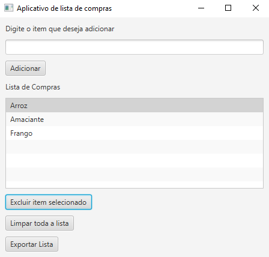
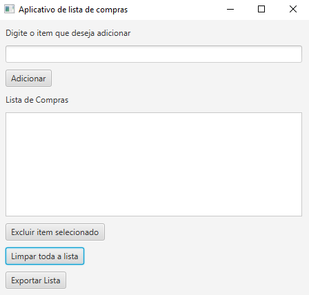
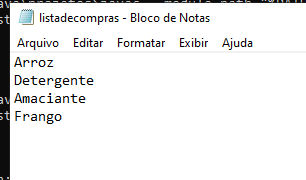

# Lista de Compras

Aplicativo desktop com interface gráfica (JavaFX) para gerenciar uma lista de compras: adicionar itens, remover, limpar tudo e exportar a lista para um arquivo de texto.

## Funcionalidades

- Adição de itens à lista, com validação para não permitir itens vazios ou duplicados
- Remoção de um item específico selecionado na lista
- Limpeza completa da lista
- Exportação da lista para um arquivo `.txt` no computador
- Interface reativa usando `ObservableList` + `ListView`

## Exemplos de uso

**Lista preenchida**



**Após excluir o item "Detergente"**



**Após limpar toda a lista**



**Arquivo `.txt` exportado**



## Como rodar

Pré-requisitos: Java JDK e JavaFX SDK configurados.

```bash
javac --module-path /caminho/para/javafx-sdk/lib --add-modules javafx.controls ProjetoListaDeCompras.java
java --module-path /caminho/para/javafx-sdk/lib --add-modules javafx.controls ProjetoListaDeCompras
```

## Tecnologias

- Java
- JavaFX (`ListView`, `ObservableList`)
- `java.io` (File, PrintWriter)
