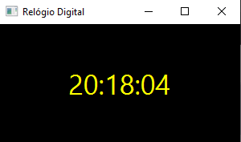

# Relógio Digital

Aplicação desktop simples com interface gráfica (JavaFX) que exibe a hora atual do sistema, atualizada em tempo real.



## Funcionalidades

- Exibe hora, minuto e segundo atuais (formato HH:mm:ss)
- Atualização automática a cada segundo, usando `Timeline` e `KeyFrame`

## Como rodar

Pré-requisitos: Java JDK e JavaFX SDK configurados.

```bash
javac --module-path /caminho/para/javafx-sdk/lib --add-modules javafx.controls ProjetoRelogioDigital.java
java --module-path /caminho/para/javafx-sdk/lib --add-modules javafx.controls ProjetoRelogioDigital
```

## Tecnologias

- Java
- JavaFX
- `java.time` (LocalDateTime, DateTimeFormatter)
